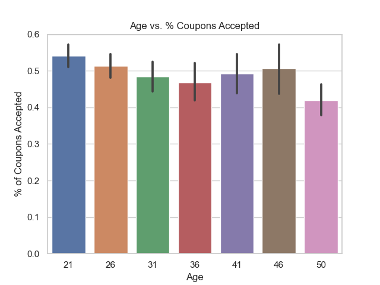

# Business Objective
Identifying a group of individuals to target with the objective of maximizing coupon acceptance rate for Coffee Houses. This way:
* Maximize traffic to the Coffee Houses
* Maximize return on investment on coupon issuance
* Reduce irrelevant coupons issued to customers to prevent customer frustration

**Hypothesis:** By targeting specific groups of people, a very high coupon acceptance rate can be achieved for Coffee Houses.

# Data Exploration and Cleaning

Dataset was checked for duplicates, missing values and improper formatting. Findings are as follows:
* Duplicates: 74 duplicates were found. Given no unique identifier in the dataset (such as person’s ID or survey ID), it is assumed that those duplicates are valid survey responses. As such, they were kept in the dataset.

### Missing Values
* 99% of the ‘car’ column is identified as missing. The column was entirely removed as it cannot be used to get any meaningful data. 
* Bar, CoffeeHouse, CarryAway, RestaurantLessThan20 and REstaurant20to50 columns have rows with a small number of missing values. Those ranged from 1-2% of total number of rows. Given the small percentage of missing values, for the ease of analysis, the rows with missing values were removed from the dataset

### Formatting
* Age, Income, Bar, CoffeeHouse, CarryAway, RestaurantLessThan20, Restaurant20to50 columns were reformatted and converted to numeric values to ease the analysis.
Following mapping was used for data transformation:
|  Column  |  Original Value | Replacement Value |
---------
Age|50plus|50

| Column      | Original Value      | Replacement Value      |
| ----------- | ------------------- | ---------------------- |
| Age | 50plus | 50 |
| Age | below21 | 21 |
| Income | Less than $12500 | 12500 |
| Income | all other ranges | Upper limit of the range |
| Income | 100000 or More | 100001 |
| Bar, CoffeeHouse, CarryAway, RestaurantLessThan20, Restaurant20To50 | less1 | 1
| Same as above | 1~3 | 3
| Same as above | 4~8 | 8
| Same as above | gt8 | 9

# Findings
1000+ coupons were issued in the survey for each coupon type. Following is a breakdown of coupons issued.

The acceptance rate of the coupons ranges from ~40% to ~75%.

Since Coffee House has the highest number of coupons and one of the categories with less than 50% acceptance rate, the effort was focused on how to improve acceptance rate of this category.

We will first investigate if customers who go to coffee house often are more likely to accept a coupon or not.

Plot below shows us that customers who visit coffee houses have a higher chance of accepting the coupon.

Destination is also an important variable that drives the acceptance rate. Those who do not have an urgent place are much more likely to visit the coffee house. It also makes sense as those going home or work may get the coffee at their destination.

It is expected that all adult age groups would be likely to have similar behavior. This assumption is validated below. Although there is slight variance, those who accepted and not accepted the coupon does not vary much across age groups.

Expiration date has an interesting behavior. Across all coffee house coupons, a coupon expiration of 1 day has a higher acceptance rate than 2 hours. However, for the specific dataset filtered by certain conditions as per group 5(coffee house, destination, passenger, friends, weather, time) , 2 hour expiration has a higher acceptance rate. This shows that the variables that behave at a certain way for the full dataset may behave differently for the pockets of the data

Based on the analysis of each variable, the variables that affect the acceptance rate the most are summarized below.
* CoffeeHouse: Those who go to CoffeeHouse 1 or more times are much more likely to accept the coupon than those who do not
* Destination: If the destination is not home, then participants are much more likely to accept the coupon. 
* Passanger: If they are traveling with friends or partner, they are much more likely to accept the coupon than traveling alone or with kid(s).
* Weather: Weather is not snowy, they’re more likely to accept the coupon
* Time: If time is 10am, they’re more likely to accept the coupon than other times
* Expiration: 2hour expiration has a higher acceptance rate than 1 day.
* Marital Status: Marital status not ‘widowed’ has a higher acceptance rate than others
* Occupation: Occupation not in certain categories (Education&Training&Library, Sales & Related, Legal, Retired, Community & Social Services, Food Preparation & Serving Related) has a higher acceptance rate.

To maximize the acceptance rate, the filters above are applied one by one on the dataset. Acceptance results are presented for the specific dataset versus the rest of the dataset.
* Group 1: Acceptance rate in those that go to coffee house 1 or more times vs. everyone else
* Group 2: Acceptance rate in those that go to coffee house 1 or more times and destination is not home
* Group 3: Filter on variable Pasenger in addition to CoffeeHouse and Destination
Group 4 … 8: Continue adding filters on the variables mentioned in the previous section

# Conclusion
The bar plot below provides us with a coupon acceptance rate, for various groups of people described earlier. It compares the acceptance rate for the people in the group (orange) vs. the people outside of the group (blue).
In summary, by targeting Group 8, it is possible to achieve up to 95% coupon acceptance rate for Coffee Houses. By targeting Groups 4 to 7, it is possible to achieve more than 80% coupon acceptance rate.

# Next Steps and Recommendations
The methodology here uses the effects of individual variables on the acceptance rate and combines them together, to find a target group with a high acceptance rate. However, for certain populations, there may be pockets of data, where this methodology may not work. As observed coupon “Expiration”, although 1 day expiration has a higher acceptance rate for the full dataset, for the subset of data that is investigated, 2 hour expiration gives us a better acceptance rate. This is illustrated in the bar chart below. So, alternative pockets of data should be further examined.
